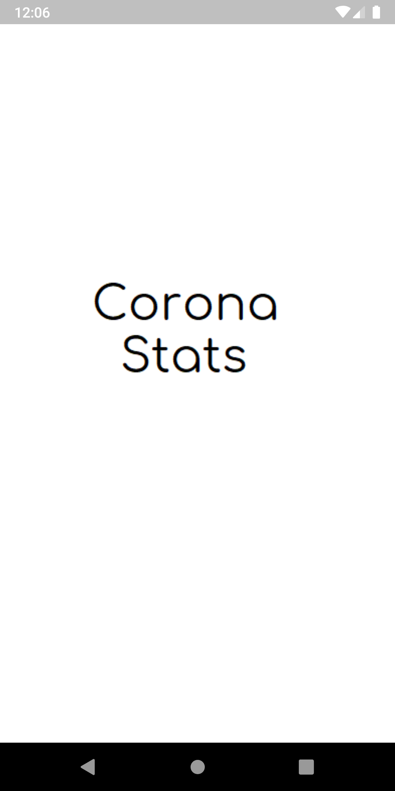
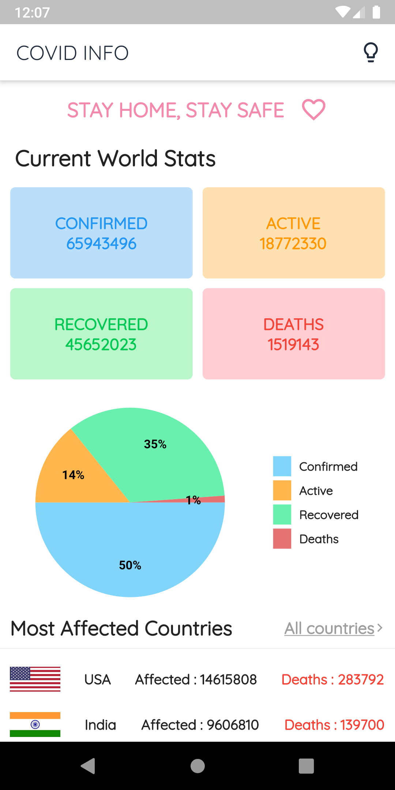
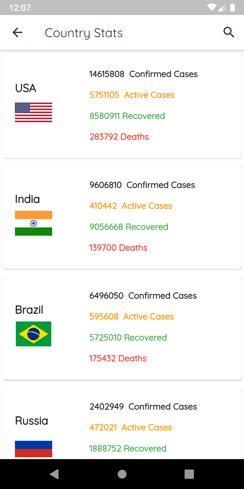
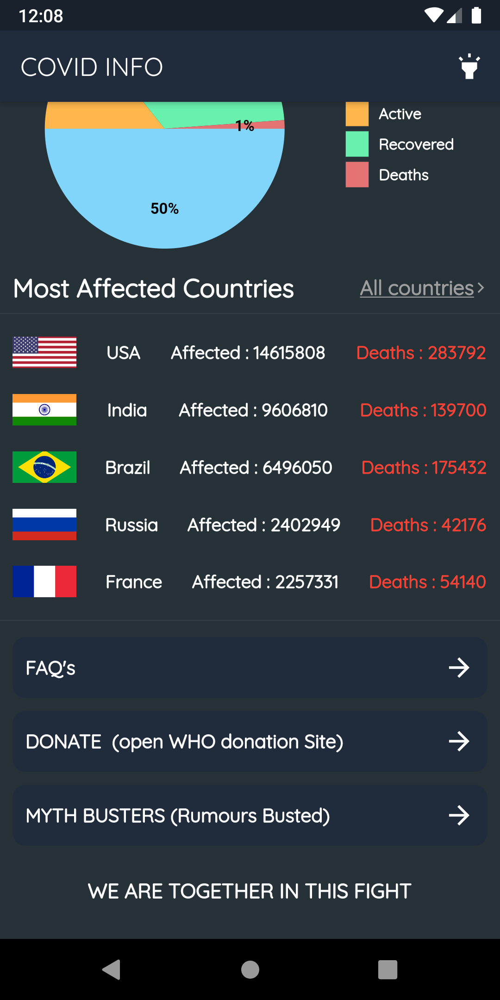
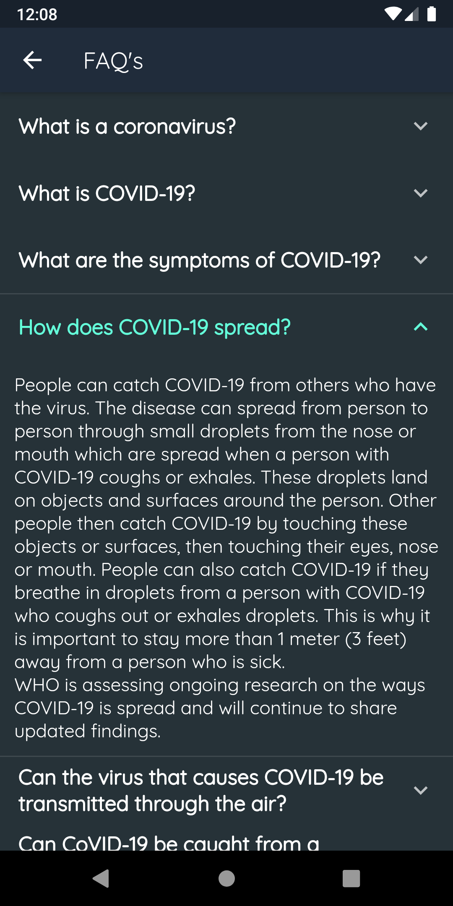

# Covid Tracker

> A simple Covid-19 Information and Tracking app built with Flutter.

###### This Project uses the below API for displaying the Information
```
corona.lmao.ninja/v2/ 
```
### Screenshots
<table>
  <tr>
    <td>
      
    </td>
    <td>
      
    </td>
    <td>
      
    </td>
    <td>
      
    </td>
  </tr>
  <tr>
    <td>
      
    </td>
  </tr>
</table>
</div>
